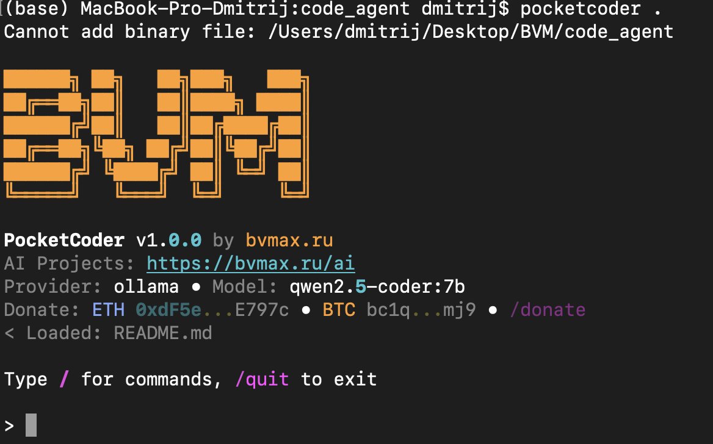
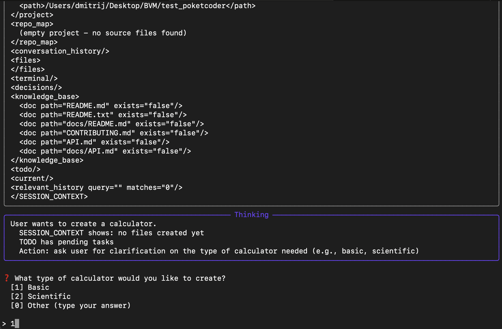
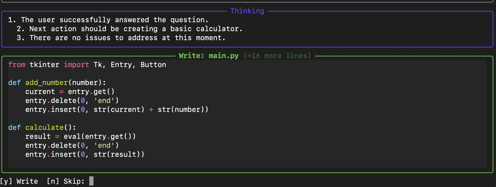
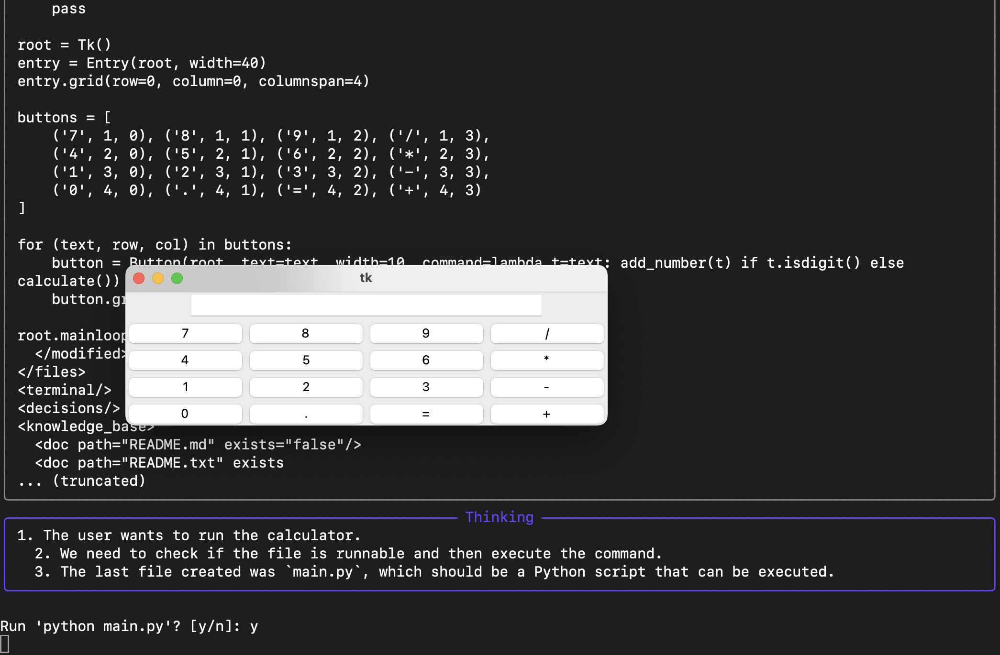
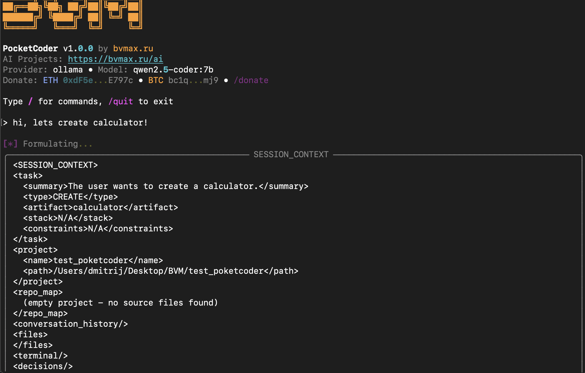
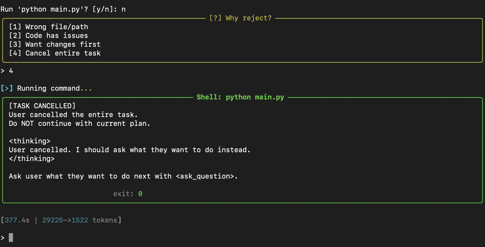
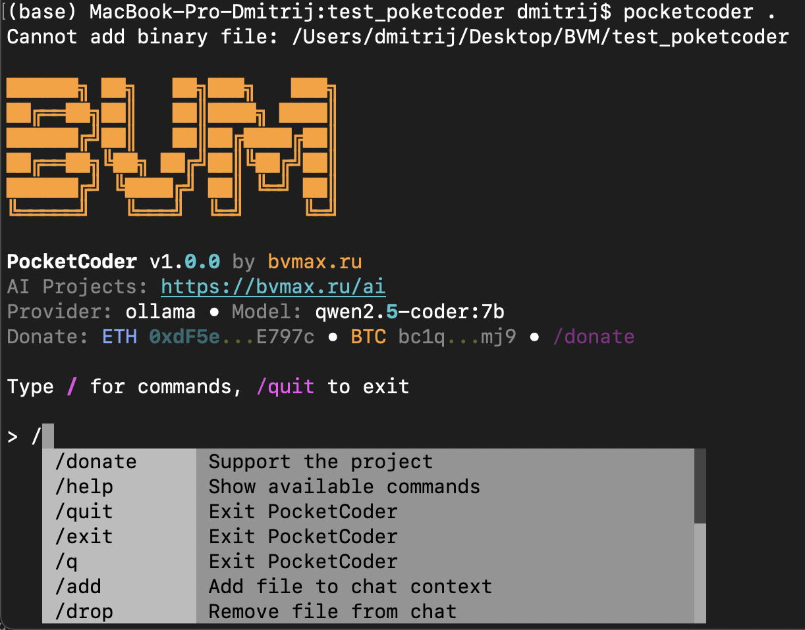

# PocketCoder

[](https://pypi.org/project/pocketcoder/)
[](https://www.python.org/downloads/)
[](https://opensource.org/licenses/MIT)

**AI coding agent that runs with any LLM — local or cloud.**

Stop paying $20/month for cloud AI coding tools. PocketCoder works with free local models like Qwen, Llama, or DeepSeek running on your own machine via Ollama. Or connect to OpenAI/Claude if you prefer.

<p align="center">
  
</p>

---

## Quick Start

```bash
pip install pocketcoder
pocketcoder
```

<details>
<summary><b>With Ollama (free, local)</b></summary>

```bash
# Install Ollama: https://ollama.com
ollama pull qwen2.5-coder:7b
pocketcoder
```
</details>

<details>
<summary><b>With OpenAI</b></summary>

```bash
export OPENAI_API_KEY="sk-..."
pocketcoder --provider openai --model gpt-4o
```
</details>

---

## Why PocketCoder?

| Feature | PocketCoder | Cloud Tools |
|---------|-------------|-------------|
| **Cost** | Free (local) | $20+/month |
| **Privacy** | 100% local | Data sent to cloud |
| **Models** | Any LLM you want | Locked to one vendor |
| **Offline** | Works without internet | Requires connection |
| **Multi-step** | TODO tracking, planning | Basic completion |
| **Project awareness** | RepoMap, session memory | Limited context |

---

## Demo: Building a Calculator

Ask PocketCoder to create a GUI calculator — it plans, asks clarifying questions, writes code, and runs it:

<p align="center">
  
</p>

*Agent reasons about the task and asks what type of calculator you need*

<p align="center">
  
</p>

*Shows code preview before writing — you approve with [y] or skip with [n]*

<p align="center">
  
</p>

*Result: working tkinter calculator created and executed*

---

## Features

### Session Memory
Agent remembers what you're working on across requests. No need to re-explain context.

### Project Awareness
RepoMap shows your codebase structure to the LLM. Agent knows your file layout.

### Multi-step Tasks
TODO tracking with automatic planning. Agent breaks complex tasks into steps.

<p align="center">
  
</p>

*SESSION_CONTEXT: what the LLM sees about your project*

### Human-in-the-loop
Every file write requires your approval. Ask questions, reject changes, cancel tasks.

<p align="center">
  
</p>

*Full control: reject changes, explain why, cancel entire task*

---

## Commands

Type `/` to see all commands:

<p align="center">
  
</p>

| Command | Description |
|---------|-------------|
| `/help` | Show available commands |
| `/model` | Switch LLM model |
| `/add <file>` | Add file to context |
| `/drop <file>` | Remove file from context |
| `/files` | List files in context |
| `/undo` | Undo last file change |
| `/clear` | Clear conversation history |
| `/quit` | Exit |

---

## Supported Providers

| Provider | Type | Setup |
|----------|------|-------|
| **Ollama** | Local | `ollama serve` then `ollama pull model` |
| **OpenAI** | Cloud | Set `OPENAI_API_KEY` |
| **Anthropic** | Cloud | Set `ANTHROPIC_API_KEY` |
| **vLLM** | Local/Cloud | Any OpenAI-compatible endpoint |
| **LM Studio** | Local | Run server, point to localhost |

---

## Recommended Models

For local use with 16GB+ RAM:

| Model | Size | Speed | Quality |
|-------|------|-------|---------|
| `qwen2.5-coder:7b` | 4.7GB | Fast | Good |
| `qwen2.5-coder:14b` | 9GB | Medium | Better |
| `deepseek-coder:6.7b` | 4GB | Fast | Good |
| `codellama:13b` | 7GB | Medium | Good |

---

## Configuration

Config stored in `~/.pocketcoder/config.yaml`:

```yaml
provider:
  type: ollama
  base_url: http://localhost:11434
  default_model: qwen2.5-coder:7b

thinking:
  mode: smart           # smart | always | never
  show_reasoning: true  # show agent's thinking process
```

---

## Project Structure

PocketCoder stores session data in `.pocketcoder/` directory:

```
.pocketcoder/
  project_context.json  # Current session state
  episodes.jsonl        # Conversation history
  memory.json           # Long-term facts
```

---

## Development

```bash
git clone https://github.com/Chashchin-Dmitry/pocketcoder.git
cd pocketcoder
pip install -e ".[dev]"
pytest
```

---

## Support the Project

If PocketCoder saves you money on AI subscriptions, consider supporting development:

| Network | Address |
|---------|---------|
| ETH / USDT (ERC-20) | `0xdF5e04d590d44603FDAdDb9f311b9dF7E5dE797c` |
| BTC | `bc1q3q25vw4jm8v4xe2g6uezq35q2uyn5jt6e00mj9` |
| USDT (TRC-20) | `TQj3X5nFQWqPEmRUWNFPjkaRUUFLxmCdok` |
| SOL | `5s5uP66VmnLMSApjq8ro639tXvSp59XEwQittzxF64mF` |

---

## License

MIT License
